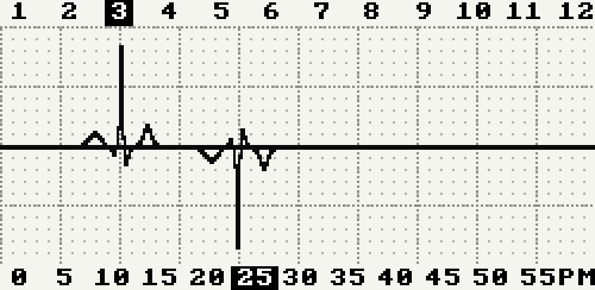
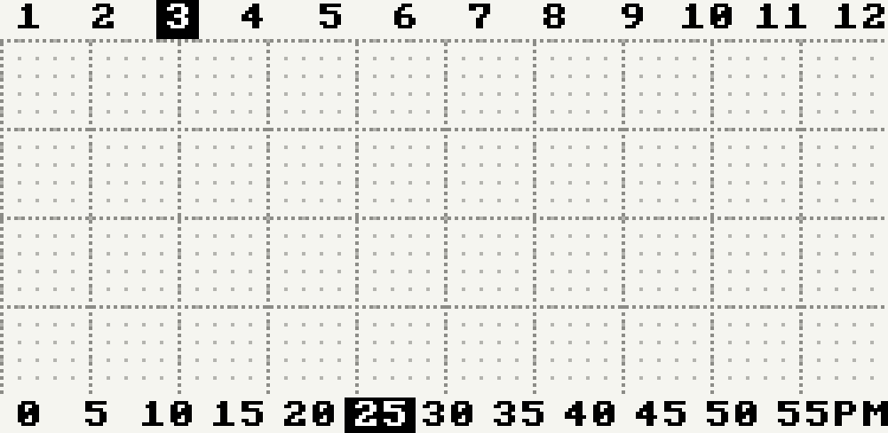

# PicoWatch ECG

An ECG-style watchface for the Raspberry Pi Pico, Waveshare 2.13" tri-color e-ink display (black/white/red), and DS3231 RTC module. Time is displayed as electrocardiogram traces on a single graph — a red upward PQRST spike marks the current hour, a red downward spike marks the current minute.


*3:23 PM — upward peak at hour 3, downward peak between minutes 20 and 25 (4x scaled from 250x122)*

## How to read it

- **Hours 1–12** are labeled across the top. The ECG R-peak spikes **upward** toward the current hour. The active hour label is inverted (white on black).
- **Minutes 0–59** are labeled across the bottom (every 5). The ECG R-peak spikes **downward** toward the current minute. The nearest 5-minute label is highlighted.
- Both traces share a common baseline through the center of the display, with an ECG-paper grid behind them.
- **AM/PM** indicator sits at the bottom right.

## Hardware

| Component | Description |
|---|---|
| Raspberry Pi Pico | RP2040, running MicroPython |
| Waveshare 2.13" e-Paper V4 | 250x122, SSD1680 controller, B/W/R tri-color |
| DS3231 RTC module | I2C, battery-backed |

## Wiring

| Display Pin | Pico Pin |
|---|---|
| E-ink VCC | 3V3 |
| E-ink GND | GND |
| E-ink DIN | GP11 (SPI1 MOSI) |
| E-ink CLK | GP10 (SPI1 SCK) |
| E-ink CS | GP9 |
| E-ink DC | GP8 |
| E-ink RST | GP12 |
| E-ink BUSY | GP13 |
| DS3231 SDA | GP0 |
| DS3231 SCL | GP1 |
| DS3231 VCC | 3V3 |
| DS3231 GND | GND |
| Button | GP15 (to GND) |

## Setup

1. Flash MicroPython onto the Pico ([download](https://micropython.org/download/RPI_PICO/)).

2. Copy the project files to the Pico using Thonny or `mpremote`:
   ```
   mpremote cp display.py rtc.py watchface.py main.py set_time.py :
   ```

3. Set the RTC clock. Edit the date/time values in `set_time.py`, then run it once:
   ```
   mpremote run set_time.py
   ```

4. Reset the Pico. The watchface starts automatically via `main.py`.

## Files

| File | Purpose |
|---|---|
| `main.py` | Entry point — reads RTC, sweep animation, tri-color render, deep sleep |
| `display.py` | SSD1680 tri-color e-ink driver configured for landscape mode (250x122) |
| `rtc.py` | DS3231 I2C driver |
| `watchface.py` | ECG watchface renderer — grid, PQRST traces, labels |
| `set_time.py` | One-time utility to set the DS3231 clock |
| `preview.py` | Desktop preview renderer (requires Pillow, not deployed to Pico) |

## Sweep animation

Press the button (GP15) to wake the Pico and trigger a sweep animation — the ECG trace travels from left to right across the display like a real heart monitor, then settles at the correct hour and minute positions with **red traces**. The Pico enters deep sleep afterward to conserve power.



## Power management

The Pico enters deep sleep after each display update. Pressing the button on GP15 wakes the Pico, which re-reads the RTC and renders the current time with the sweep animation. The e-ink display retains the last image while the Pico sleeps, so the time stays visible with near-zero power draw.

## Display updates

- The sweep animation uses **partial refresh** (~0.3 s per frame) in black/white for speed.
- The final frame uses a **full tri-color refresh** (~2-3 s) to render the ECG traces in red.
- The display enters sleep mode along with the Pico after each update.

## Desktop preview

Generate a preview image at any time without the hardware:

```
pip install Pillow
python preview.py 14 30    # renders 2:30 PM
```
